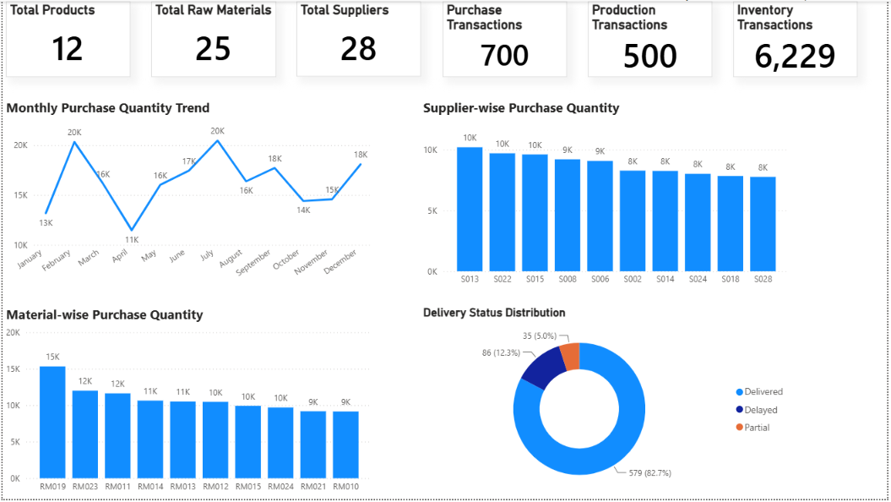
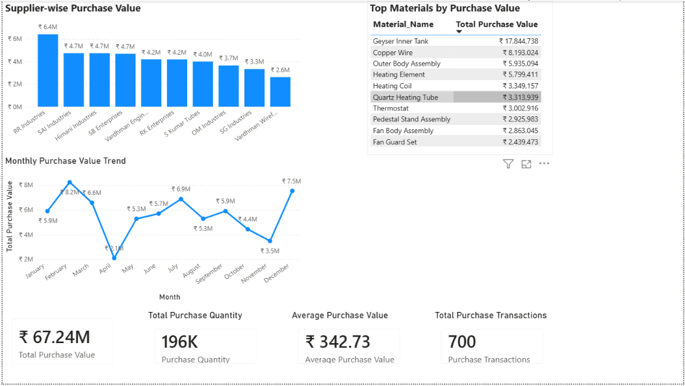
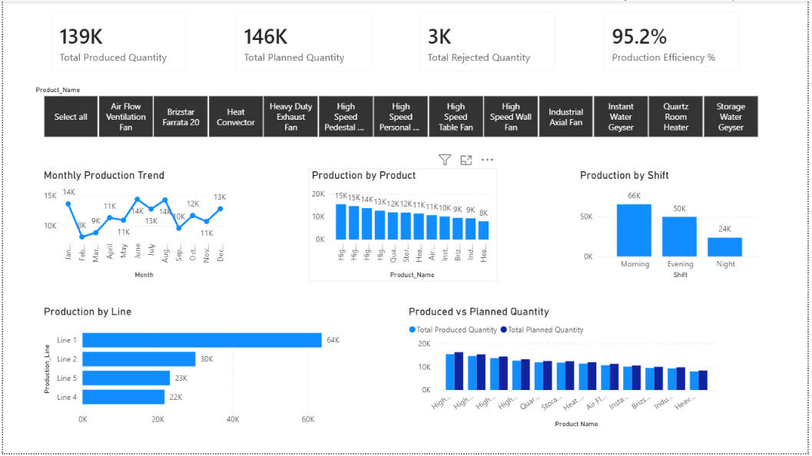

# Manufacturing Inventory Analytics

## Project Overview

This project analyzes a manufacturing inventory dataset covering raw materials, suppliers, bill of materials, purchase transactions, production transactions, and inventory movements for the 2025 business year.

The goal is to identify purchasing patterns, supplier and material contribution, production performance, inventory movement, and operational KPIs using Excel, SQL, and Power BI.

## Tools Used

- Microsoft Excel: data modeling, formulas, pivot tables, charts, and analysis sheets
- MySQL / SQL: database setup, data validation, joins, aggregations, and business analysis queries
- Power BI: dashboard reporting and KPI visualization

## Folder Structure

```text
Manufacturing_Inventory_Analytics/
├── 01_Raw_Data/
├── 02_Excel_Analysis/
├── 03_SQL/
│   └── 01_SQL_Scripts/
├── 04_PowerBI/
└── 05_Project_Documentation/
```

## Dataset Scope

The verified project data covers:

| Area | Verified Count |
|---|---:|
| Products | 12 |
| Raw Materials | 25 |
| Suppliers | 28 |
| BOM Records | 133 |
| Purchase Transactions | 700 |
| Production Transactions | 500 |
| Inventory Transactions | 6,229 |

Date coverage: January 1, 2025 to December 31, 2025.

## Key Metrics

| Metric | Value |
|---|---:|
| Total Purchase Quantity | 196,193 |
| Total Purchase Value | 67,241,528.37 |
| Delivered Purchases | 579 |
| Delayed Purchases | 86 |
| Partial Purchases | 35 |
| Delivery Rate | 82.71% |
| Planned Production Quantity | 145,921 |
| Produced Quantity | 138,937 |
| Rejected Quantity | 2,800 |
| Production Efficiency | 95.21% |
| Rejection Rate | 2.02% |

## Analysis Performed

### Excel Analysis

- Created structured tables for products, raw materials, suppliers, BOM, purchases, production, and inventory.
- Built purchase and production analysis sheets.
- Used formulas, pivot tables, and charts for KPI summaries and trend analysis.
- Verified purchase value using discount and GST adjusted calculation.

### SQL Analysis

- Built SQL scripts for database setup and business analysis.
- Validated purchase, production, inventory, and BOM level metrics.
- Corrected purchase value logic to include discount and GST.
- Removed duplicate inventory insert data to keep inventory transactions accurate.

### Power BI Dashboard

The Power BI report includes three verified pages:

1. Purchase Quantity Analysis
2. Purchase Value Analysis
3. Production Quantity Analysis

The dashboard includes KPI cards, line charts, column charts, bar charts, donut chart, table visual, and product slicer.

#### Dashboard Screenshots

**Purchase Quantity Analysis**



**Purchase Value Analysis**



**Production Quantity Analysis**



## Business Insights

- Total purchase value for 2025 was approximately 67.24M after applying discount and GST.
- 82.71% of purchase transactions were delivered successfully.
- Total production efficiency was 95.21%, with 138,937 units produced against 145,921 planned units.
- Rejected quantity was 2,800 units, giving a 2.02% rejection rate against produced quantity.
- Inventory data includes opening stock, purchase receipts, and production issue transactions.

## Files Included

- `01_Raw_Data/`: source datasets in Excel/CSV format
- `02_Excel_Analysis/Manufacturing_Inventory_Analysis.xlsx`: Excel analysis workbook
- `03_SQL/01_SQL_Scripts/01_Business_Analysis.sql`: final corrected SQL analysis script
- `04_PowerBI/Manufacturing_Inventory_Analysis_PowerBI.pbix`: Power BI report file
- `05_Project_Documentation/`: project documentation and verified metrics

## Verification Notes

The final SQL file was corrected before documentation:

- Purchase value formula includes discount and GST.
- Duplicate inventory INSERT block was removed.
- Invalid `quantity_in_stock` reference was removed.
- Final active SQL file contains one inventory insert block with 6,229 unique inventory transaction IDs.

